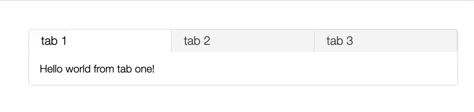

# snabbdom-tabs

a tab panel implemented in snabbdom




## features

* data oriented, functional design
* tiny! (~100 lines of code)


## usage

requires node >= v12.17 or a browser that supports the es module format.


via `npm`:
```javascript
import html from 'snabby'
import tabs from 'snabbdom-tabs'
```

via a pure es module (browser or `deno`):
```javascript
import html from 'https://cdn.skypack.dev/snabby'
import tabs from 'https://cdn.skypack.dev/tabs'
```

```javascript
const model = tabs.init({
    selectedIndex: 1,
    headers: [
        'tab 1',
        'tab 2',
        'tab 3'
    ]
})


function view (model, update) {
    const tabViews = [
        html`<div>Hello world from tab one!</div>`,
        html`<div>Believe me I know tabs, I have the best tabs. Nobody does tabs like I do.</div>`,
        html`<div>For now the eggs lay dormant but soon the gators will rise from the swamps.</div>`
    ]

    return tabs.view(model, tabViews, update)
}
```


# references

The tab panel css and html was modified from https://www.digitalocean.com/community/tutorials/js-tabs
